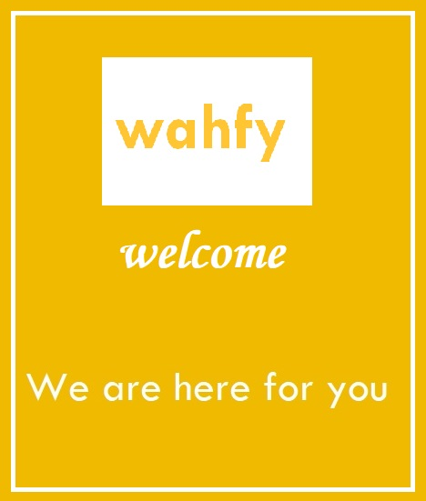
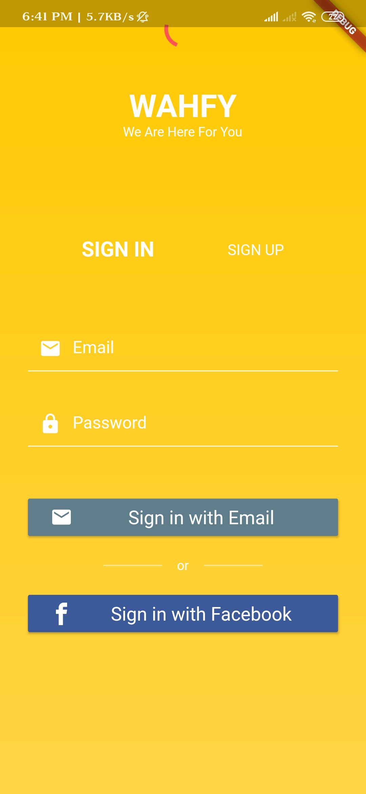
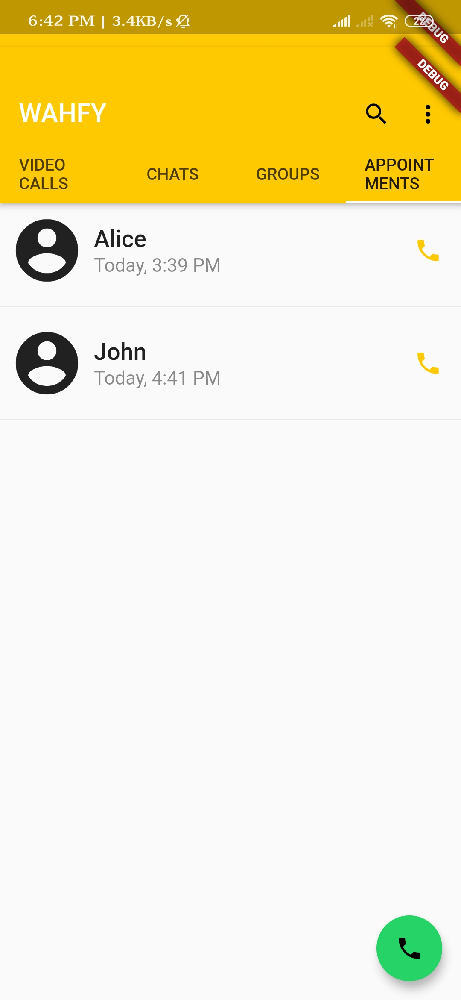
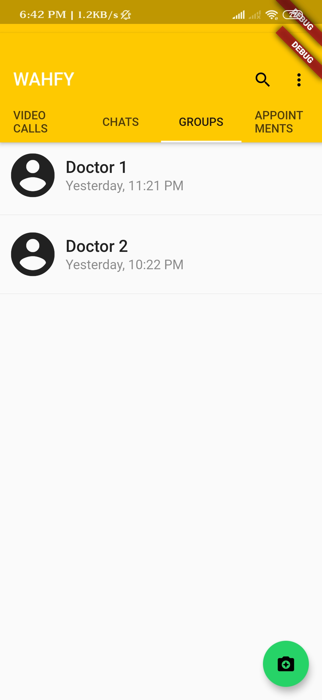

# Project Mental Illness Hackathon

| Project Title : **Project Mental Illness Hackathon** |

This was my **Flutter based** project. The tools used in this project are **Flutter Framework**. The Idea behind this project won **3rd** place in the Hackathon held in **MSRUAS** .

## Technical Features

* **Login/Register** feature implemented with the help of **Firebase**.
* Chat UI.
* Social Authentication

## Screenshots

